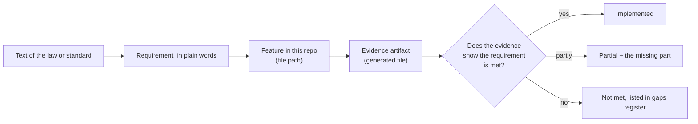

# Compliance mapping

This section ties **specific features** to **specific legal and standards text**. It exists because
"supports DORA" is not a useful statement. "Art. 12(2) says backups must be tested periodically; this
drill does that; here is the measured result; here is what is still missing" is.

| Framework | Page | Nature of the text | Quoted here? |
|---|---|---|---|
| DORA (Regulation (EU) 2022/2554) | [DORA](dora.md) | Binding EU regulation | Short verbatim quotations of the key paragraphs |
| NIS2 (Directive (EU) 2022/2555) | [NIS2](nis2.md) | EU directive (national law implements it) | Short verbatim quotations |
| ISO/IEC 27001:2022 Annex A | [ISO 27001](iso27001.md) | Paid, copyrighted standard | **No**, control numbers and titles only |
| NIST SP 800-53 Rev 5 | [NIST 800-53](nist80053.md) | US Government publication | Shortened quotations from NIST's catalog |
| MITRE ATT&CK | [ATT&CK mapping](../07-attack-mapping.md) | Public knowledge base | Technique names and links |
| **Everything that falls short** | [Gaps register](gaps.md) | | |

## How a mapping row is built

## Rules these pages follow

1. A row may link to **evidence only if it is a generated artifact**, never to a file that describes intent.
2. A feature is credited with **what it demonstrably does**. Where evidence is a single run, the row says so.
3. **Synthetic inputs are labelled.** Client counts, economic impact and contract fields are lab fixtures.
4. Where this repository falls short of the text, **the shortfall is stated in the same row**, and listed in the [gaps register](gaps.md).
5. Mappings in the evidence manifest (`docs/evidence/manifest.yaml`) are authoritative for OSCAL output. Rows here that go beyond the manifest are explicitly labelled **proposed**.

A test checks that every tag in the manifest appears on the right page here.

## Cross-framework view

One piece of evidence usually supports several frameworks at once:

| Evidence | DORA | NIS2 | ISO 27001 | NIST 800-53 | ATT&CK |
|---|---|---|---|---|---|
| `ns-restore-20260728152755.json` | Art. 11, 12 | 21(2)(c) | A.8.13 | CP-9, CP-10 | none |
| `detection-latency-20260729135024.txt` | Art. 10 | none | A.8.16 | SI-4, AU-6 | T1485 |
| `credential-compromise-20260730044858.txt` | Art. 10, 24-27, 28-30 | none | A.8.16 | SI-4, IR-4, SA-11, SR-3, SR-4 | T1059.004 |
| `kyverno-admission-20260728202845.txt` | Art. 9 | none | none | CM-7 | none |
| `incident-response-20260729210627.txt` | Art. 13, 18, 19 | Art. 23 | A.5.25-A.5.27 | IR-4, IR-6 | none |

The complete, always-current index is generated into
[`docs/evidence/report.md`](https://github.com/Utility-SOC/dora-blueprint/blob/main/docs/evidence/report.md).
