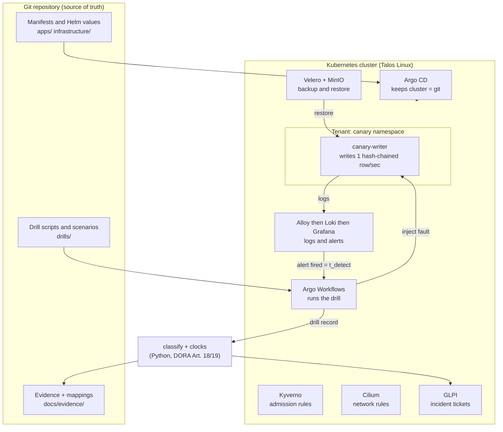
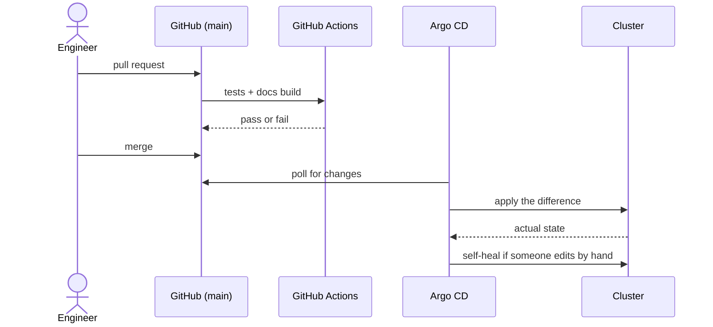

# How it works

*Start with the picture; the detail follows.*

## The one-minute version

Think of the platform as a small town with rules, not just a building.

- **Rules at the door.** A policy engine ([Kyverno](../components/kyverno.md)) inspects every new
  workload and turns away insecure ones.
- **Walls between districts.** A network layer ([Cilium](../components/cilium.md)) blocks all
  traffic between parts of the platform unless a rule explicitly allows it.
- **A single source of truth.** Everything the platform should look like is written in files in
  this git repository. A robot ([Argo CD](../components/argo-cd.md)) continuously compares the
  running platform to those files and fixes any difference.
- **Cameras and alarms.** Logs flow into a store ([Loki](../components/loki.md)); alert rules in
  [Grafana](../components/grafana.md) fire when they see something bad.
- **A fire drill programme.** [Argo Workflows](../components/argo-workflows.md) runs scripted
  failures, a backup system ([Velero](../components/velero.md)) restores, and Python scripts time
  and judge the result.
- **A filing cabinet with tamper seals.** Results are saved as evidence files, mapped to
  regulations, and chained with fingerprints.

## The big picture

## Life of one drill: `make drill SCENARIO=ns-restore`

| Step | What happens | Why it matters | Code |
|---|---|---|---|
| 1 | Record the canary's current row counter | Gives a "before" to compare against to count lost data | [`ns-restore-workflowtemplate.yaml`](https://github.com/Utility-SOC/dora-blueprint/blob/main/drills/templates/ns-restore-workflowtemplate.yaml) |
| 2 | Find the most recent completed Velero backup | Recovery can only be as fresh as the last backup | same |
| 3 | **Delete the whole `canary` namespace** (`t_inject`) | The fault. A real, destructive action | same |
| 4 | Grafana's alert rule notices the delete in the Kubernetes audit log (`t_detect`) | Detection comes from an *independent* system, not from the script grading itself | [`apps/core/grafana.yaml`](https://github.com/Utility-SOC/dora-blueprint/blob/main/apps/core/grafana.yaml) |
| 5 | Restore the backup into a *freshly named* namespace | "Restoring in place proves nothing" | Velero |
| 6 | Wait for the restored pod to be healthy (`t_recover`) | End of the outage clock | workflow |
| 7 | Verify the data's hash chain | Catches the silent failure where a restore "succeeds" but the data is empty or wrong | [`canary/verify.py`](https://github.com/Utility-SOC/dora-blueprint/blob/main/canary/verify.py) |
| 8 | Compute **RTO** (inject to recover) and **RPO** (records lost) | The headline numbers | workflow |
| 9 | Classify as major or non-major; compute DORA and NIS2 deadlines | Shows how the incident would have been triaged and when notifications would be due | [`classify.py`](https://github.com/Utility-SOC/dora-blueprint/blob/main/drills/lib/classify.py), [`clocks.py`](https://github.com/Utility-SOC/dora-blueprint/blob/main/drills/lib/clocks.py) |
| 10 | Open a ticket in GLPI with all of the above | A durable incident register entry | [`open-incident.py`](https://github.com/Utility-SOC/dora-blueprint/blob/main/drills/lib/open-incident.py) |

### The five scenarios

| Scenario | The fault | What it proves | Primary controls |
|---|---|---|---|
| `ns-restore` | Delete a namespace, restore from backup | Backup and restore actually work; measured RTO/RPO | DORA Art. 11, 12 |
| `node-kill` | Make a node look unreachable | How the platform behaves when a server disappears | DORA Art. 11, 24-27 |
| `pvc-corruption-restore` | Corrupt the database file in place | The hash chain detects silent corruption; restore fixes it | DORA Art. 12 |
| `network-partition` | Apply, then remove, a network deny | Network rules are really enforced, in both directions | DORA Art. 9; ISO A.8.20 |
| `credential-compromise` | Steal a service token and spawn a shell | Runtime monitoring detects it and an alert fires | DORA Art. 10; ATT&CK T1059.004 |

Each scenario is described in [`drills/scenarios/`](https://github.com/Utility-SOC/dora-blueprint/tree/main/drills/scenarios)
and has a runbook in [`docs/runbooks/`](https://github.com/Utility-SOC/dora-blueprint/tree/main/docs/runbooks).

## Platform versus tenant

The **platform** is the shared set of controls (network rules, admission rules, backup, monitoring,
the drill framework). A **tenant** is a regulated application running on it. The example tenant is
a fictional payments firm, "Meridian Pay", represented by the tiny `canary` application. The
distinction matters for audits: the platform can guarantee some things for any tenant, while
others (such as retention periods) must be decided per tenant. See
[Shared responsibility](../05-shared-responsibility.md).

## Two deployment tiers

| Tier | Command | Adds |
|---|---|---|
| `core` | `make lab-core` | Everything the `ns-restore` drill needs: cluster, networking, admission control, storage, logging, backup, workflows, ticketing |
| `full` | `make lab-full` | Identity and single sign-on (Keycloak, OpenLDAP), runtime security (Tetragon), vulnerability scanning (Trivy) |
| `dr` | `make lab-dr` | **Not built.** Needs a genuine second cluster |

## How a change reaches the cluster (GitOps)

Two things sit outside GitOps on purpose: `bootstrap/install.sh` (which creates the cluster and
decrypts the secrets, because something has to start the robot) and Talos node configuration
(applied with `talosctl`). Details in [Operations](../06-operations.md).

## Where each file lives

| Folder | Contents |
|---|---|
| `bootstrap/` | The one-time installer, secrets, Argo CD root application |
| `platform/talos/` | Operating-system level configuration for the nodes |
| `apps/core/`, `apps/full/` | One Argo CD Application per component, by tier |
| `infrastructure/` | Per-component configuration (policies, dashboards, scripts) |
| `canary/` | The tiny tenant application and its integrity checker |
| `drills/` | Scenarios, workflows, schema, and the classification and clock code |
| `docs/evidence/` | Evidence samples, the tagging manifest, generators, integrity chain |
| `images/` | Container image definition and the Register of Information generator |
| `tests/` | The offline test suite |
